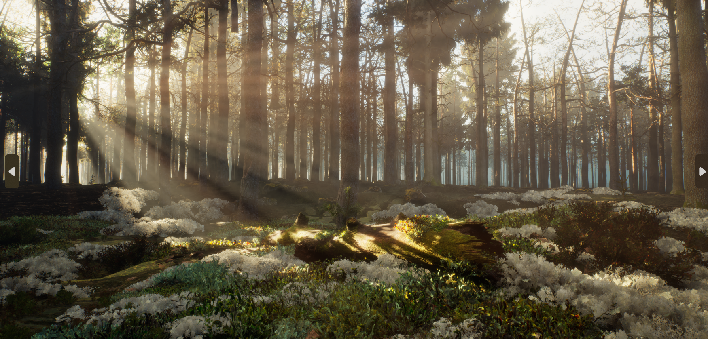
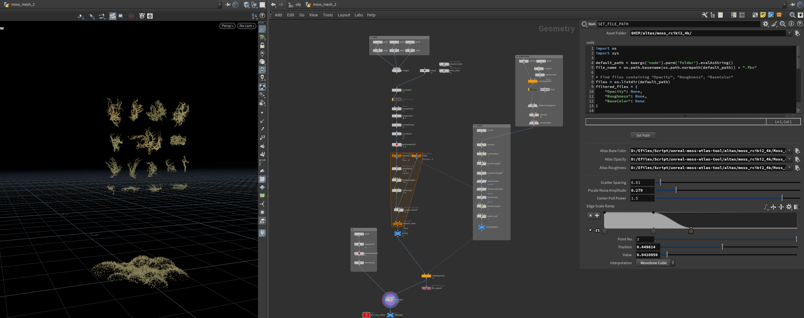

# unreal-moss-atlas-tool

A Houdini tool to create moss foliage from atlas texture for Unreal Engine.

## Features

- Automatically cuts the atlas texture and scatters it on the surface as unreal foliage.
- Automatically finds and sets texture maps for Opacity, Roughness, and BaseColor.
- Configures the FBX export node with the appropriate file path.

## Requirements

- Houdini
- Unreal Engine

## Usage

1. Ensure your texture files are named with "Opacity", "Roughness", and "BaseColor" in their filenames.
2. Run the script to automatically set the texture parameters and configure the FBX export node.

### Unreal Moss Render

### Houdini Tool Screenshot

